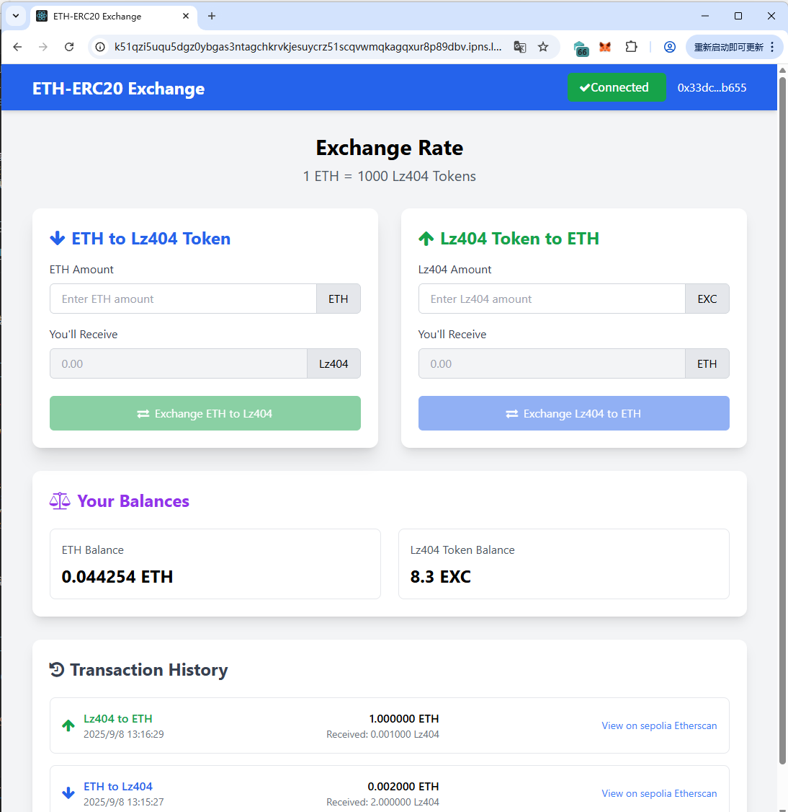

# ETH-ERC20 Exchange 项目 README

## 项目简介

`ETH-ERC20 Exchange` 是一个基于 Web 技术构建的 ERC20 代币交易相关前端项目，旨在提供 ERC20 代币的交易交互界面（如代币兑换、余额查询等核心功能的前端载体）。项目采用 React 前端架构，确保跨设备兼容性与开发效率，并支持部署至 IPFS 实现去中心化访问。

配套的后端代码地址：
https://github.com/zhangfeilu/ETH_Exchange_Backend_JS

合约地址：https://sepolia.etherscan.io/address/0x85859D01CADD9253774E8a730fa2316957432303

## 前端页面



## 一、项目核心技术栈

| 技术类别   | 具体技术/工具                  | 作用说明                                                                  |
| ---------- | ------------------------------ | ------------------------------------------------------------------------- |
| 基础结构   | HTML5                          | 构建页面的语义化结构，定义内容层级（如根容器 `#root`）                    |
| 样式框架   | Tailwind CSS（CDN 引入）       | 快速实现响应式 UI 设计，提供原子化 CSS 类，无需编写大量自定义样式         |
| 图标库     | Font Awesome 4.7.0（CDN 引入） | 提供丰富的图标资源（如交易、钱包、箭头等图标），增强界面交互性            |
| 区块链交互 | Ethers.js 5.6（注释中引用）    | 用于与以太坊网络交互，实现 ERC20 代币的转账、余额查询、交易签名等核心功能 |
| 前端框架   | React                          | 用于构建组件化界面，管理前端状态，提升代码可维护性                        |

## 二、第三方库/资源清单

项目通过 CDN 直接引入第三方资源，无需本地安装，具体如下：

| 资源名称     | 版本                       | 引入方式               | 资源地址                                                                   | 用途             |
| ------------ | -------------------------- | ---------------------- | -------------------------------------------------------------------------- | ---------------- |
| Tailwind CSS | 最新稳定版（CDN 自动指向） | `<script>` 标签（CDN） | `https://cdn.tailwindcss.com`                                              | 样式开发         |
| Font Awesome | 4.7.0                      | `<link>` 标签（CDN）   | `https://cdn.jsdelivr.net/npm/font-awesome@4.7.0/css/font-awesome.min.css` | 图标展示         |
| Ethers.js    | 5.6                        | `<script>` 标签（CDN） | `https://cdn.ethers.io/lib/ethers-5.6.umd.min.js`                          | 以太坊区块链交互 |

## 三、IPFS 部署步骤

IPFS（InterPlanetary File System）是一个去中心化文件存储网络，可将项目部署至 IPFS 实现全球去中心化访问。以下是详细部署流程（以 **本地 IPFS 节点** 为例，也可使用 Pinata 等第三方 IPFS 服务）：

### 前置准备

1. **安装 IPFS 客户端**

   - 前往 [IPFS 官方下载页](https://dist.ipfs.tech/#kubo)，根据操作系统（Windows/macOS/Linux）下载 `Kubo`（IPFS 核心实现）。
   - 安装完成后，在终端执行 `ipfs init` 初始化本地 IPFS 节点（首次使用需执行，会生成节点身份信息）。

2. **准备项目文件**
   - 确保项目根目录下包含所有必要文件：`index.html`（核心页面）、后续集成的 JS/CSS 文件（如 React 打包后的 `build` 目录、自定义脚本等）。
   - 若已集成前端框架（如 React），需先执行打包命令生成静态文件（例：React 项目执行 `npm run build`，生成的 `build` 目录即为待部署资源）。

### 部署步骤（本地节点方式）

1. **启动 IPFS 节点**  
   在终端执行以下命令，启动本地 IPFS 节点服务：

   ```bash
   ipfs daemon
   ```

   启动成功后，终端会显示节点连接信息，默认可通过 `http://127.0.0.1:5001/webui` 访问 IPFS 管理界面。

2. **上传项目文件至 IPFS**

   - 打开新的终端窗口，进入项目根目录（或前端框架打包后的静态文件目录，如 React 的 `build` 目录）。
   - 执行以下命令将文件添加到 IPFS 网络（`./` 表示当前目录下所有文件，可替换为具体文件路径）：
     ```bash
     ipfs add -r ./
     ```
     - `-r` 参数表示“递归上传”，适用于多文件/目录场景。
     - 上传完成后，终端会输出每个文件的 `CID`（Content Identifier，IPFS 中文件的唯一标识），**记录根目录的 CID**（通常是最后一行输出的 `CID`，对应上传的文件夹）。

   示例输出：

   ```
   added QmXxXxXxXxXxXxXxXxXxXxXxXxXxXxXxXxXxXxXxXx index.html
   added QmYyYyYyYyYyYyYyYyYyYyYyYyYyYyYyYyYyYyYyYyYy build
   added QmZzZzZzZzZzZzZzZzZzZzZzZzZzZzZzZzZzZzZzZzZzZ (根目录 CID)
   ```

3. **验证部署结果**
   - 通过本地 IPFS 网关访问：在浏览器中输入 `http://127.0.0.1:8080/ipfs/[根目录 CID]`，若能正常加载 `ETH-ERC20 Exchange` 页面，则部署成功。
   - 通过公共 IPFS 网关访问（供他人访问）：使用公共网关（如 `https://ipfs.io/ipfs/[根目录 CID]` 或 `https://gateway.pinata.cloud/ipfs/[根目录 CID]`），即可在全球范围内访问项目。

## 四、注意事项

1. **CID 唯一性**：每次修改项目文件后，重新上传至 IPFS 会生成新的 `CID`，需更新访问链接。
2. **文件完整性**：确保上传的目录包含所有依赖文件（如后续集成的 JS 脚本、图片资源等），避免因缺失文件导致页面报错。
3. **Ethers.js 集成**：若需实现区块链交互功能，需移除 `index.html` 中 Ethers.js 引用的注释，并编写相关逻辑（如连接钱包、调用 ERC20 合约方法）。
4. **响应式适配**：项目已通过 `meta name="viewport"` 配置移动端适配，部署后需在不同设备上验证界面显示效果。

## 五、后续开发建议

1. 集成前端框架（如 React）：通过 `create-react-app` 创建项目，将 `index.html` 作为模板，把核心组件挂载到 `#root` 容器。
2. 实现钱包连接功能：使用 Ethers.js + MetaMask 钱包，实现“连接钱包”“获取账户余额”等基础交互。
3. 集成 ERC20 交易逻辑：调用 ERC20 合约的 `transfer`、`approve`、`transferFrom` 等方法，实现代币兑换功能。
4. 优化 IPFS 访问：可将项目 CID 绑定到 ENS（以太坊域名服务），使用域名（如 `exchange.eth`）替代冗长的 CID 访问。
